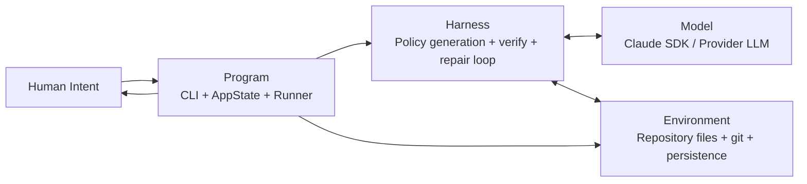
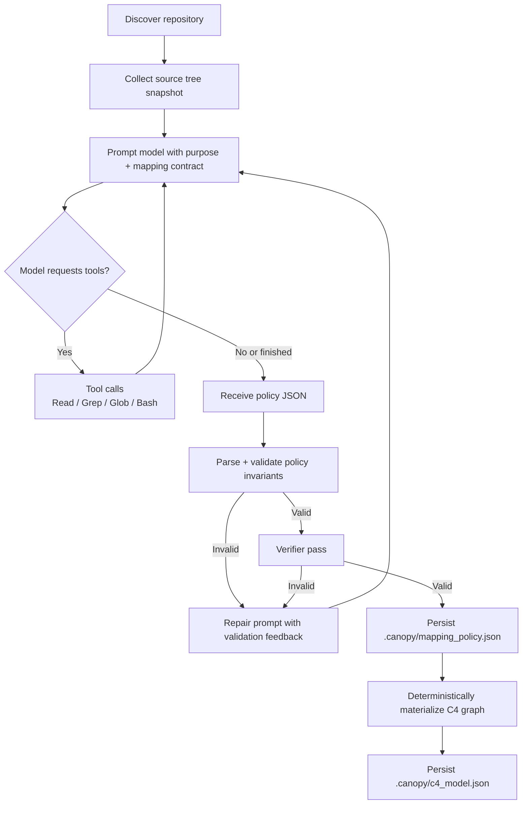

# AI Engineering and C4 Pipeline

This document describes how Canopy applies the Program/Harness/Environment/Model framing and how source code becomes an executable C4 model.

## Program, Harness, Environment, Model

## C4 Mapping Construction Pipeline

## Accuracy Rules

1. Mapping is content-informed, not filename-only.
2. Every source file must be explicitly included or excluded by policy.
3. Policy output must satisfy structural and semantic validation before acceptance.
4. Deterministic graph materialization preserves repeatability after policy approval.
